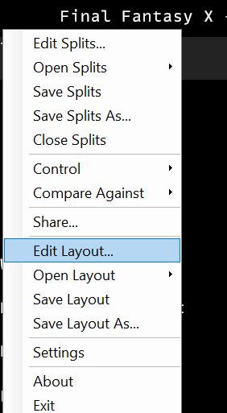
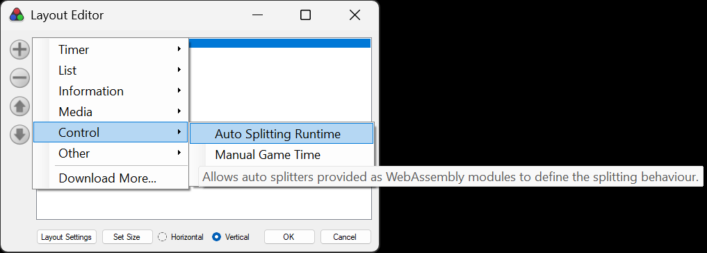
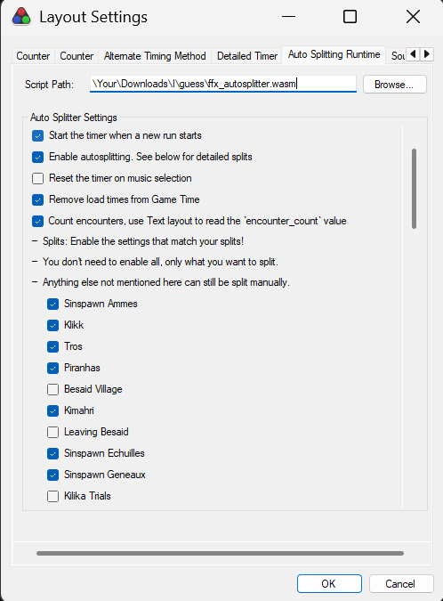
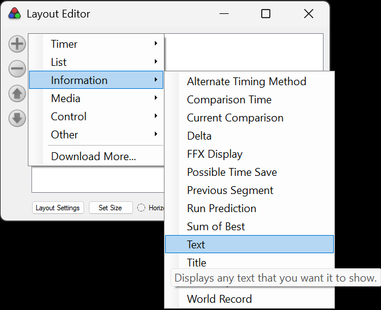
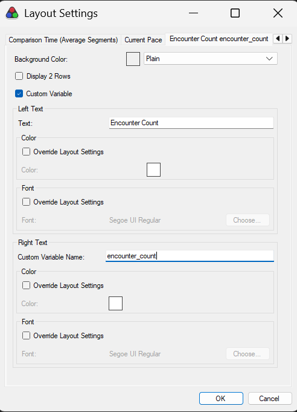

# Final Fantasy X (PC HD Remaster) Auto Splitter

An alternative to the [official autosplitter](https://www.speedrun.com/ffx/guides/vnxps).

## Differences

- Written for the new [Auto Splitter Runtime](https://github.com/LiveSplit/LiveSplit.AutoSplitters?tab=readme-ov-file#sandboxed-auto-splitters) instead of being a component
  - Autosplitter is sandboxed and isolated from LiveSplit
  - Autosplitter works with more timer runtimes, such as LiveSplit One or the LiveSplit OBS Plugin
- Includes more split options (all disabled by default)
  - Left Besaid Village
  - Traveled Besaid Road
  - Ifrit obtained
  - Completed Chocobo Eater
  - ~~Executed MRR Skip (when moving to the next zone)~~ contributed that one to the official autosplitter
  - Ixion obtained
  - Entering Moonflow (Point of no return for Stone Breath)
  - Traveled Macalania Woods
  - Shiva obtained
  - Arrived at Home
  - After Via Purifico Grid
  - Traveled through Calm Lands
  - Reached Zanarkand Temple
  - Done with Tetris
  - Beat Spectral Keeper
  - Finished Eggs/Crystals/The Nucleus
- (Hopefully) fixed a few bugs:
  - Lagoon/Piranhas sometimes not splitting
  - ~~Some fights not splitting when the fight was reset (e.g. Wendigo)~~ contributed that one to the official autosplitter

## Features

- ✅ Start timer on new game, accoring to the rules
- ✅ Configurable splits
- ✅ Stop timer when Yu Yevon is defeated, according to the rules
- ✅ Reset the timer when a new game is started
- ✅ Remove load times
- ✅ Provides an encounter count to display in LiveSplit

## Usage

> [!IMPORTANT]
> If you have the official Autosplitter enabled, you need to disable it
>
> To do so, follow the first two steps of https://www.speedrun.com/ffx/guides/vnxps, but in Step 2, click 'Deactivate' instead

1. Go the [Latest release](https://github.com/knutwalker/ffx-autosplitter/releases/tag/latest)

1. Download the [`ffx_autosplitter.wasm` file](https://github.com/knutwalker/ffx-autosplitter/releases/download/latest/ffx_autosplitter.wasm) from the list of Assets

1. Open LiveSplit, right click and select 'Edit Layout'

   

1. Add a new component, select 'Control' > 'Auto Splitting Runtime' (Don't choose 'Scriptable Auto Splitter', that would be for ASL files).

   

1. Double click the new component to configure it. Set the 'Script Path' to the file downloaded in the first step. Go through the settings below that and enable/disable the splits to match your splits file.

   

1. To add the 'Encounter Count', add a new 'Information' > 'Text' component

   

1. Double click the new component to configure it. Check the 'Custom Variable' box, then set the 'Custom Variable Name' (in the 'Right Text' section) to this exact value: `encounter_count`. Set the 'Left Text' > 'Text' to `Encounter Count`.

   

---

# Developer section

## Build from source

This auto splitter is written in Rust. In order to compile it, you need to
install the Rust compiler: [Install Rust](https://www.rust-lang.org/tools/install).

Afterwards install the WebAssembly target:

```sh
rustup target add wasm32-unknown-unknown --toolchain stable
```

The auto splitter can now be compiled:

```sh
cargo b --release
```

The auto splitter is then available at:

```
target/wasm32-unknown-unknown/release/ffx_autosplitter.wasm
```

Make sure to look into the [API documentation](https://livesplit.org/asr/asr/) for the `asr` crate.

## Development

You can use the [Auto Splitting IDE](https://github.com/CryZe/auto-splitting-ide) while
developing the auto splitter to more easily see the log messages, statistics,
dump memory, step through the code and more.

The repository comes with preconfigured Visual Studio Code tasks. During
development it is recommended to use the `Debug Auto Splitter` launch action to
run the `asr-debugger`. You need to install the `CodeLLDB` extension to run it.

You can then use the `Build Auto Splitter (Debug)` task to manually build the
auto splitter. This will automatically hot reload the auto splitter in the
`asr-debugger`.

Alternatively you can install the [`cargo
watch`](https://github.com/watchexec/cargo-watch?tab=readme-ov-file#install)
subcommand and run the `Watch Auto Splitter` task for it to automatically build
when you save your changes.

The debugger is able to step through the code. You can set breakpoints in VSCode
and it should stop there when the breakpoint is hit. Inspecting variables may
not work all the time.
